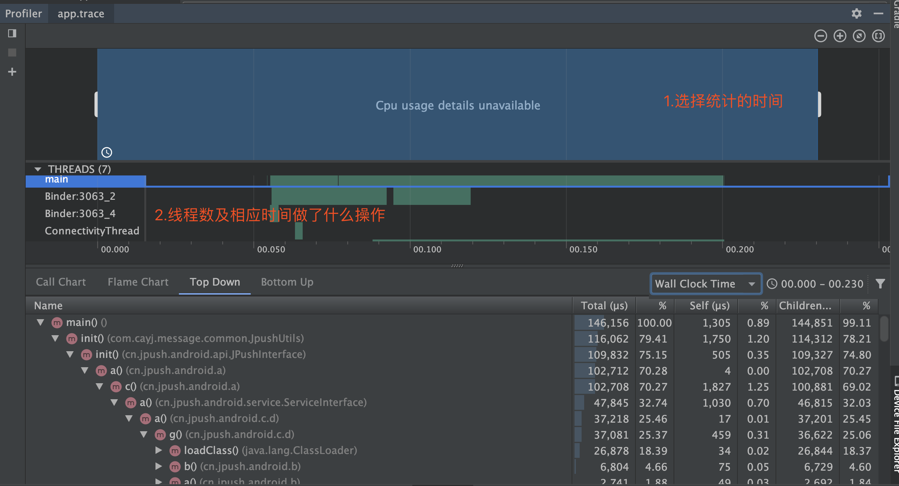
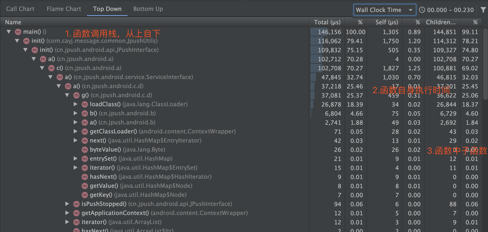
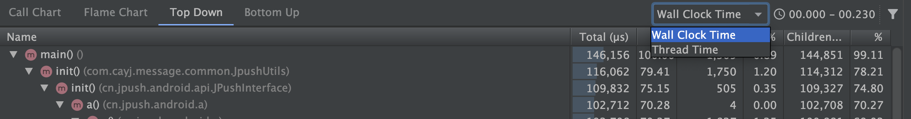
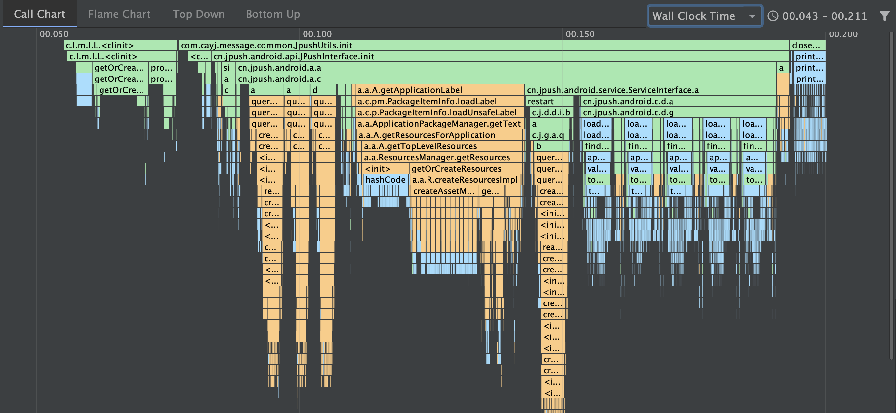
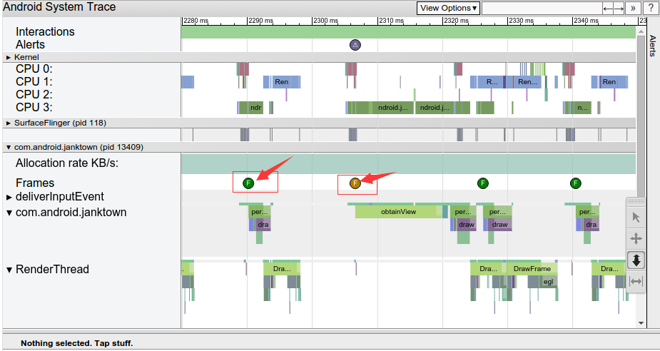

# 【三】启动优化工具

### traceview

#### 介绍

- 图形的形式展示执行时间、调用栈等；
- 信息全面，包含所有线程；
- 功能过于强大，运行时开销严重，整体会变慢；(它会抓取所有线程的所有执行函数)可能会带編优化方向；

#### 使用方式

* 开始执行

  ```kotlin
  //传入保存的文件名，该方法有多个重载形式
  Debug.startMethodTracing("xxx")
  ```

* 结束执行

  ```kotlin
   Debug.stopMethodTracing()
  ```

* 文件位置 

  生成文件在sd卡：**sdcard/Android/data/packagename/files**

#### 图解

* 整体图

  

* 函数调用Top-Down

  

  * Top Down表示函数调用栈；
  * Total表示该函数执行的总时间；
  * Self表示该函数自身代码执行时间；
  * Children表示该函数中的子函数执行时间；

* Wall Clock Time和Thread Time

  

  * Wall Clock Time表示该线程真正执行的时间；
  * Thread Time表示Cpu真正执行时间；

* Call Chart

  

  * 函数调用栈及对应的时间消耗；
  * 橙色表示系统Api调用；
  * 绿色表示自身函数调用；
  * 蓝色表示Java函数调用；

### systrace

#### 介绍

* 结合Android内核的数据，生成Html报告；
* API 18以上使用，推荐TraceCompat；
* 轻量级，开销小；
* 直观反映cpu利用率；
* cpuTime和wallTime区别；(优化方向为cpuTime)
  * wallTime是代码执行时间；
  * cpuTime是代码消耗cpu的时间(重点指标)

#### 使用方式

```shell
python systrace.py [options] [category1] [category2] ... [categoryN]
```

* options可取值：

| options                                    | 解释                                                         |
| ------------------------------------------ | ------------------------------------------------------------ |
| -o <FILE>                                  | 指定trace数据文件的输出路径，如果不指定就是当前目录的trace.html |
| -t N, –time=N                              | 执行时间，默认5s。绝对不要把时间设的太短导致你操作没完Trace就跑完了，这样会出现Did not finish 的标签，分析数据就基本无效了 |
| -b N, –buf-size=N                          | buffer大小（单位kB),用于限制trace总大小，默认无上限          |
| -k <KFUNCS>，–ktrace=<KFUNCS>              | 追踪kernel函数，用逗号分隔                                   |
| -a <APP_NAME>,–app=<APP_NAME>              | 这个选项可以开启指定包名App中自定义Trace Label的Trace功能。也就是说，如果你在代码中使用了Trace.beginSection("tag"), Trace.endSection；默认情况下，你的这些代码是不会生效的，因此，这个选项一定要开启 |
| –from-file=<FROM_FILE>                     | 从文件中创建互动的systrace                                   |
| -e <DEVICE_SERIAL>,–serial=<DEVICE_SERIAL> | 指定设备，在特定连接设备上进行跟踪，由[设备序列号](https://developer.android.com/studio/command-line/adb.html#devicestatus)标识 。 |
| -l, –list-categories                       | 这个用来列出你分析的那个手机系统支持的Trace模块，一般来说，高版本的支持的模块更多 |

* category可取值：

| category      | 解释                                                         |
| ------------- | ------------------------------------------------------------ |
| gfx           | Graphic系统的相关信息，包括SerfaceFlinger，VSYNC消息，Texture，RenderThread等；分析卡顿非常依赖这个。 |
| input         | Input                                                        |
| view          | View绘制系统的相关信息，比如onMeasure，onLayout等。。        |
| webview       | WebView                                                      |
| wm            | Window Manager                                               |
| am            | ActivityManager调用的相关信息；用来分析Activity的启动过程比较有效。 |
| sm            | Sync Manager                                                 |
| audio         | Audio                                                        |
| video         | Video                                                        |
| camera        | Camera                                                       |
| hal           | Hardware Modules                                             |
| app           | Application                                                  |
| res           | Resource Loading                                             |
| dalvik        | 虚拟机相关信息，比如GC停顿等。                               |
| rs            | RenderScript                                                 |
| bionic        | Bionic C Library                                             |
| power         | Power Management                                             |
| sched         | CPU调度的信息，非常重要；你能看到CPU在每个时间段在运行什么线程；线程调度情况，比如锁信息。 |
| binder_driver | Binder驱动的相关信息，如果你怀疑是Binder IPC的问题，不妨打开这个。 |
| core_services | SystemServer中系统核心Service的相关信息，分析特定问题用。    |
| irq           | IRQ Events                                                   |
| freq          | CPU Frequency                                                |
| idle          | CPU Idle                                                     |
| disk          | Disk I/O                                                     |
| mmc           | eMMC commands                                                |
| load          | CPU Load                                                     |
| sync          | Synchronization                                              |
| workq         | Kernel Workqueues                                            |
| memreclaim    | Kernel Memory Reclaim                                        |
| regulators    | Voltage and Current Regulators                               |

* 常用方式

  ```shell
  python systrace.py -t 10 -a com.xxx.packagename -o xxx.html sched gfx view wm am app
  ```

#### 图解



该报告列出了呈现UI帧并指示沿时间线的每个渲染帧的每个进程。用`绿色`框架圆圈表示在16.6毫秒内渲染以保持每秒60帧稳定所需的帧。渲染时间超过16.6毫秒的帧用`黄色`或`红色`框架圆圈表示。


