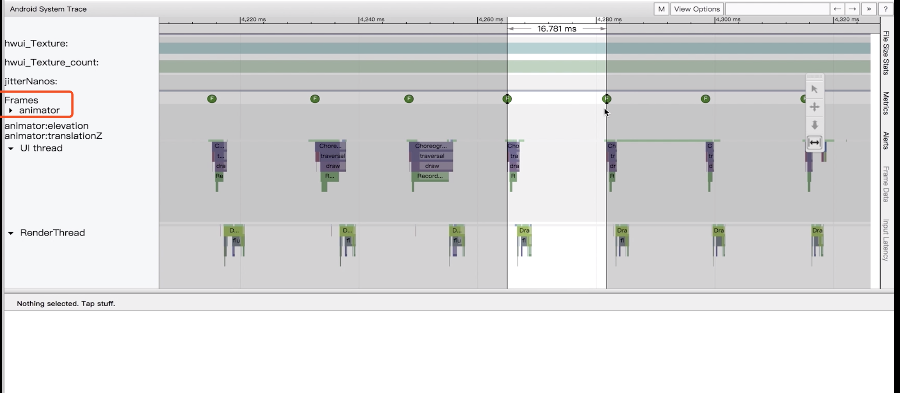
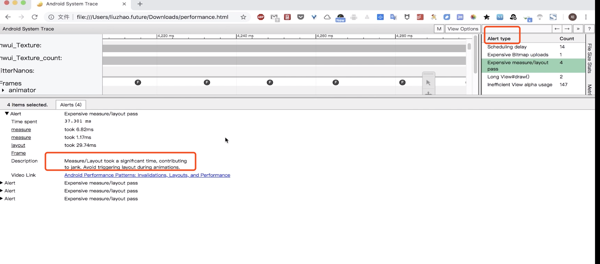
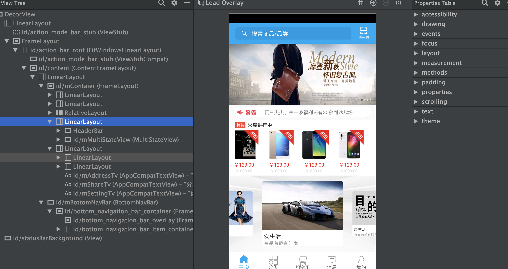

# App布局优化

### 绘制原理

* 人眼与大脑之间的协作无法感知超过60fps的画面更新；

  > app的性能标准就是保证60fps这个值，也就代表每一帧，只有1000/60 = 16ms的时间来处理任务。 

* CPU负责计算显示内容（视图创建、布局计算、图片解码、文本绘制等）；

* GPU负责栅格化(UI元素绘制到屏幕上，把组件（如Button、Bitmap）拆分成像素进行显示，然后完成绘制)；

* Android系统每隔16ms发出VSync信号触发UI渲染，这就要求每一帧的渲染需要在16ms内完成。

  > 我们在使用app的时候，会发现有多的时候，界面会出现卡顿不流畅的情况，是因为当前这个界面UI的处理超过了16ms,则会占用下一个16ms,这样就导致16ms * 2 都是显示的同一帧，也就是我看到的“卡了”。

### 优化工具

* Systrace

  * 关注Frames
  * 正常：绿色圆点，丢帧：黄色或红色
  * Alert栏

  

  

* Layout Inspector

  > AS自带工具，可查看视图层次结构



* Choreographer

  * 获取FPS，线上使用，具备实时性
  * Api16之后才能使用

  ```java
  Choreographer.getInstance().postFrameCallback();
  ```

  