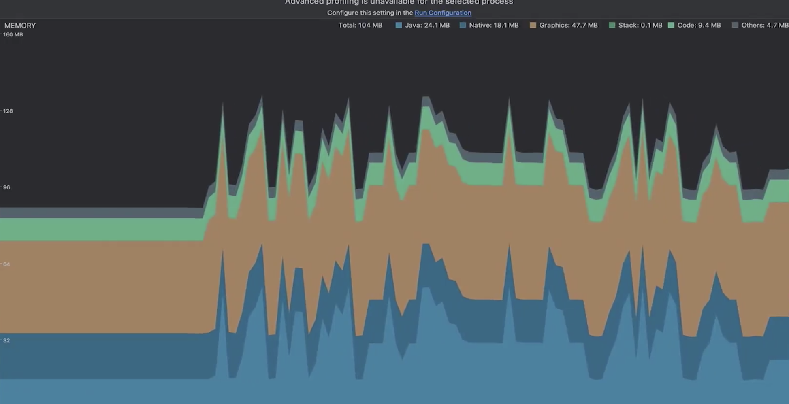
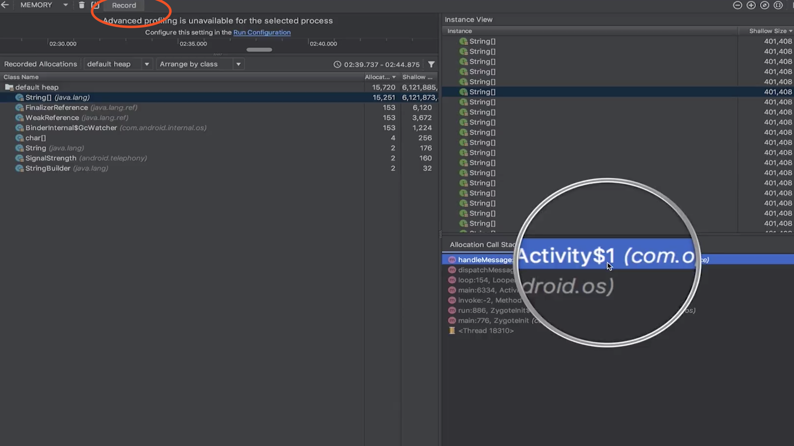

# 【四】内存抖动

### 介绍

#### 定义

内存频繁分配和回收导致内存不稳定。

#### 表现

频繁GC、内存曲线呈锯齿状。

#### 危害

导致卡顿、OOM

> * 频繁创建对象，导致内存不足及碎片(不连续)；
> * 不连续的内存片无法被分配，导致OOM；

### 解决方案

#### Memory Profiler初步排查

#### 使用record记录内存使用，查找具体调用位置

### 解决技巧

由于是因为频繁创建和回收对象，所以可以去找**循环或频繁调用的位置**。