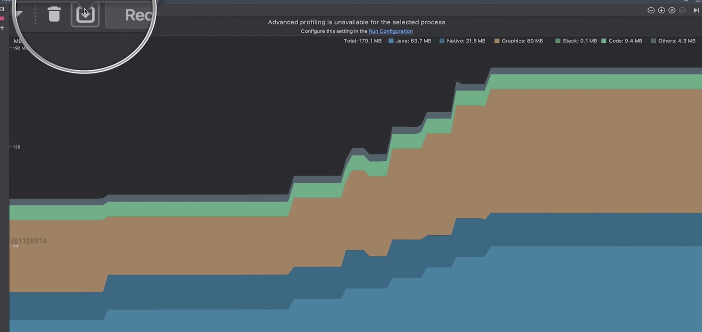
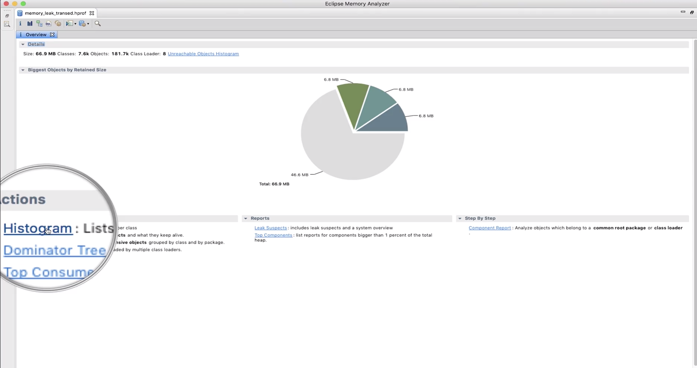
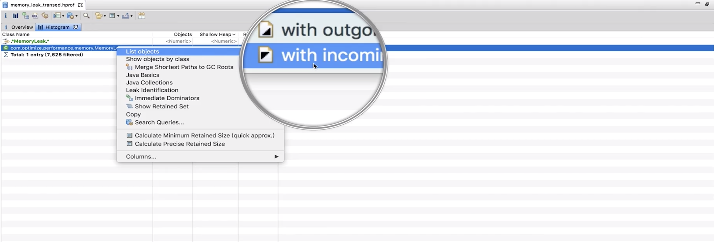

# 【五】内存泄露

### 介绍

#### 定义

内存中存在已经没有用的对象。

#### 表现

内存抖动、可用内存逐渐减少。

#### 危害

内存不足、GC频繁、OOM

### 解决方案

* 使用Memory Profiler dump内存信息并保存

  

* 通过hprof-conv转换保存的文件，供MAT使用

  ```shell
  hprof-conv xxx.hprof xx-conv.hprof
  ```

* 使用MAT打开文件

  

  